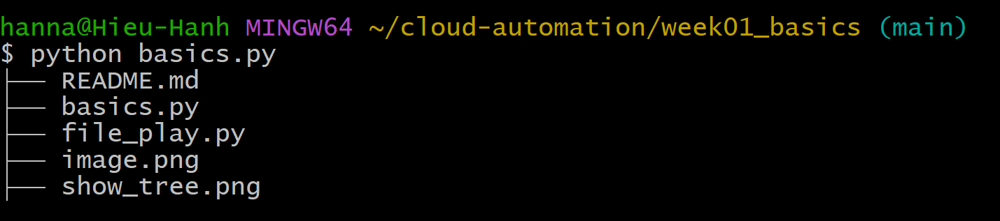
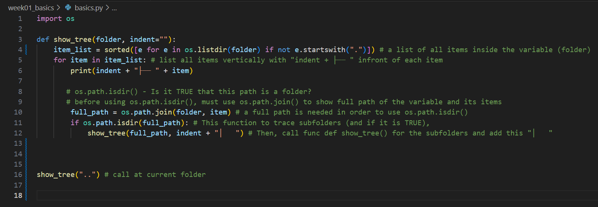

# Project: Recursive File Tree Builder + CLI Folder Creation

## What It Does

1. Automates folder and file creation using CLI and Python  
2. Recursively walks through a folder and prints its structure visually  
3. Mimics the `tree` command using Unicode characters for readability
4. `tree` command in CLI — but built from scratch in Python.
5. Great for learning recursion and understanding file system traversal.

---

## How to Run It

### 1. Init repo

```bash
git init
git remote add origin https://github.com/cloudspecialist195/cloud-automation.git
git push -u origin main
mkdir cloud-automation
cd cloud-automation
mkdir week01_basics && cd week01_basics
touch basics.py file_play.py README.md .gitignore
```
### 2. Run the Script

```bash
cd cloud-automation/week01_basics
python basics.py
```



## Key Concepts Used
* os.listdir() — list path contents
* os.path.join() — safely build path (Win/Mac/Linux)
* os.path.isdir() — check if an item is a folder
* Recursion — call a function within itself to go deeper
* CLI execution — run Python in Git Bash
* Unicode formatting — draw folder trees with │, ├──




## Why I Built This
I'm transitioning from healthcare into cloud automation.
This project helped me understand:
* Path traversal - how to programmatically navigate folder structures
* How to build files that interact with system infrastructure

## What I Learned
Difference between GUI and CLI file behavior
How recursion works at each level of the file tree
The importance of clean CLI output for debugging
How to structure beginner scripts like real CLI tools


